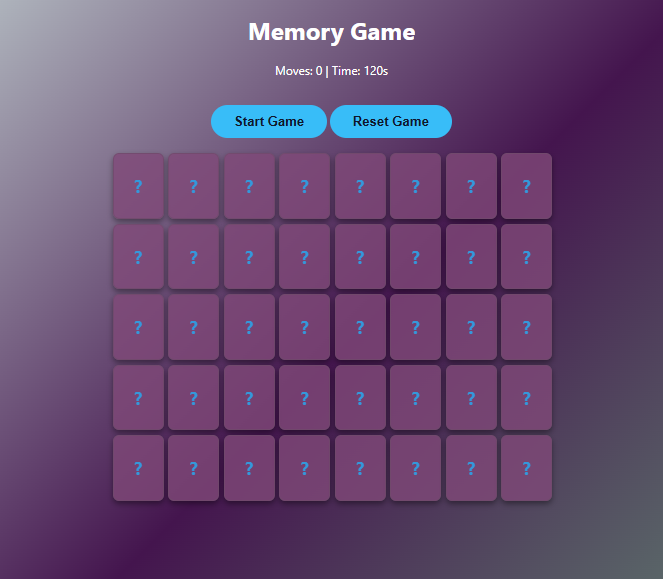

# 🎴 Advanced Grid Memory Matrix Game (Development Workspace)

Welcome to the active development repository for the **Memory Game Dashboard**. Engineered using semantic vanilla frontend core mechanics, this web application deploys a comprehensive multi-card interactive grid designed to evaluate and sharpen cognitive retention, pattern tracking, and sequential verification loops.

The engine actively monitors structural player interactions, tracking total moves and running an asynchronous countdown timeline while dynamically processing card flip animations and state validation checks.

---

## 🤵 Repository Host Details

- **Author Name:** amir
- **GitHub Profile Alias:** [amirsohail100](https://github.com/amirsohail100)
- **Official Communication Endpoints:** amirsoahil10@gmail.com
- **Project Status:** Active Development (Beta Phase) 🟡

---

## 🖥️ Graphical User Interface Preview (UI Showcase)

Below is the live execution environment layout showing the responsive card matrices, game control hubs, and real-time operational statistic panels from my workspace:

<!-- Memory Game Modern UI Display Section -->
<div align="center">
  
  <p><i>Gameplay Hub — Multi-Row Interactive Matrix Layout with State Controls, Move Arrays, and Temporal Trackers</i></p>
</div>

---

## 📂 Source Code Architecture

The platform splits configuration paths cleanly across three modular base structural documents within the repository root tree:

- **`index.html`:** Compiles the central blueprint layout housing the primary game name, HUD counter displays (Moves & Time tracking loops), control trigger buttons, and the main card arena wrapper.
- **`style.css`:** Implements the rich purple gradient atmosphere layout, card perspectives, active flex rows, customized button padding scales, and responsive box dimensions.
- **`app.js`:** Powers the central game state engine. It handles initial board setup array shuffles, button event listeners, sequential two-card click validation buffers, and point/move tally tracking.

---

## 🛠️ Core Features & Algorithmic Milestones

- **State Utility Controls:** Programmed interactive action blocks (**Start Game** / **Reset Game**) to bind session generation procedures, refresh matrix orientations, and safely wipe running tracking vectors.
- **Live Performance HUD:** Configured continuous metric variables tracking total user click attempts (**Moves**) paired with a precise **120-second countdown temporal interval wrapper**.
- **Comprehensive Grid Processing:** Manages structural grid alignments to map card layouts systematically while binding separate identification datasets on individual grid targets.
- **Target Validation Buffer:** Implements brief operational delays using async intervals to handle misaligned selection reversals gracefully, while matching pairs lock down indefinitely.

---

## 💻 Technical Stack Components

- **Markup Layer:** HTML5 Semantic Framework Buttons & Wrapper Containers
- **Visual Presentation:** Custom CSS3 (Gradient Vectors, Bounding Grid Layouts, Focus Box Shadows, Responsive Shifting)
- **Execution Logic:** ES6+ JavaScript Script Pipelines (Asynchronous Timing Loops, Target State Shuffling, Event Triggers)

---

## 🚀 How to Run the Application Locally

Follow these clear guidelines to launch the arcade matrix on your local machine:

### 1. Clone the Target Terminal Endpoint

```bash
git clone [https://github.com/amirsohail100/your-memory-game-repo.git](https://github.com/amirsohail100/your-memory-game-repo.git)
cd your-memory-game-repo
```
